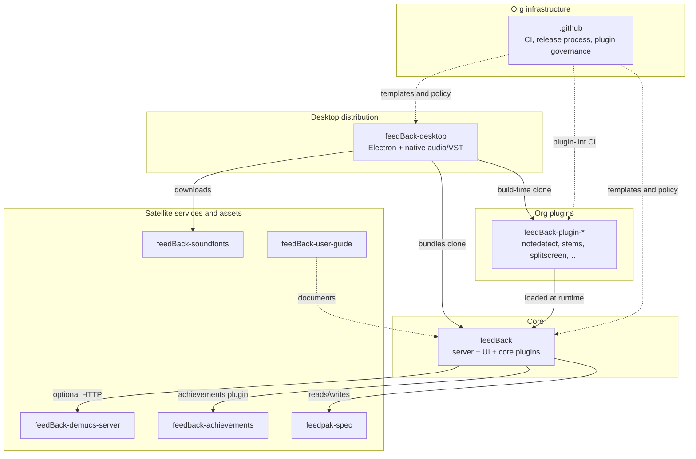

# Contributing to FeedBack

Thanks for wanting to contribute! This document covers the legal and workflow expectations for code, plugins, and documentation contributions.

## License

FeedBack is licensed under [AGPL-3.0-only](LICENSE). Contributions you submit (PRs, patches, documentation, plugin entries in the curated list) are licensed inbound under the same terms — **inbound = outbound**. By opening a pull request, you agree that your contribution may be distributed under AGPL-3.0-only as part of FeedBack.

## Developer Certificate of Origin (DCO)

We use the [Developer Certificate of Origin](https://developercertificate.org/) (DCO) to track contribution provenance. Every commit must be signed off:

```bash
git commit -s -m "your commit message"
```

This appends a line to your commit message like:

```text
Signed-off-by: Jane Developer <jane@example.com>
```

The sign-off certifies that you wrote the code (or have the right to submit it) and that you're contributing it under AGPL-3.0-only as the LICENSE file describes. The full text of the certification is at [developercertificate.org](https://developercertificate.org/).

If you forget to sign off, amend the most recent commit with `git commit --amend -s` (or rebase + sign off older commits) and force-push to your PR branch.

## Plugin licensing

Plugins live in their own repositories and are loaded at runtime — see the [Plugin System section in CLAUDE.md](CLAUDE.md) for the technical contract, and [Plugin Best Practices](CLAUDE.md) for the conventions every plugin should follow (v2/v3 player chrome, the visualization contracts, and the **performance rules** — no per-frame DOM queries or broad `document.body` `MutationObserver`s — that keep the 60 fps highway smooth). Plugins are not subject to AGPL by being loaded into FeedBack (the loader runs them as separate Python modules / browser scripts), but for the **curated plugin list** to accept your plugin we ask that it be released under an AGPL-3.0-compatible license:

- AGPL-3.0-only or AGPL-3.0-or-later
- GPL-3.0-only or GPL-3.0-or-later
- LGPL-3.0-only or LGPL-3.0-or-later
- MIT
- BSD-2-Clause or BSD-3-Clause
- Apache-2.0
- ISC
- Unlicense / CC0-1.0 / 0BSD

Plugins under GPL-2.0-only, LGPL-2.1-only, CDDL, EPL, or proprietary terms will not be added to the curated list. You're still free to publish and self-distribute them — FeedBack will load any plugin a user installs locally — but they won't be promoted from the main project.

## Workflow

Standard PR workflow described in [CLAUDE.md → Git Workflow](CLAUDE.md):
- Never push directly to `main`.
- Create a feature branch on your fork.
- Open a PR against `got-feedback/feedBack:main`.
- Keep commits scoped and well-described; short imperative subject + `Signed-off-by` trailer.

## Repository landscape

FeedBack is the **hub** of the [got-feedback](https://github.com/got-feedback) organization: a self-hosted FastAPI + vanilla JS app (Docker/NAS) with a plugin runtime. Most sibling repositories either ship inside it, wrap it, extend it, or document/specify what it uses. Knowing which repo to target saves you from opening a PR in the wrong place.



### Where to contribute

| Repository | What it is | Open your PR here when you are changing… |
|---|---|---|
| [**feedBack**](https://github.com/got-feedback/feedBack) (this repo) | Core web app: `server.py`, `static/`, `lib/`, Docker image | Server API, highway/WebSocket, library UI, core data models, bundled plugins under `plugins/`, tests in `tests/` |
| [**feedBack-desktop**](https://github.com/got-feedback/feedBack-desktop) | Electron shell: native audio, VST hosting, installers | Desktop-only audio/VST, packaging, bundling scripts, platform-specific bugs |
| [**feedBack-plugin-***](https://github.com/orgs/got-feedback/repositories?q=feedBack-plugin) | One repo per org plugin (`plugin.json`, optional `routes.py` / `screen.js`) | A specific plugin's behavior, settings, or backend — **not** core unless you are promoting it to bundled |
| [**feedpak-spec**](https://github.com/got-feedback/feedpak-spec) | Open `.feedpak` / `.sloppak` format spec, schemas, validator | Chart package format, wire-format fields, authoring docs for chart files |
| [**feedBack-user-guide**](https://github.com/got-feedback/feedBack-user-guide) | End-user documentation (MkDocs, GitHub Pages) | User-facing how-to articles, screenshots, launch docs — not developer reference in this repo |
| [**feedBack-demucs-server**](https://github.com/got-feedback/feedBack-demucs-server) | Optional GPU service for stem separation and lyrics alignment | Demucs/WhisperX pipeline, separation API — not the in-app stems toggle UI (that is `feedBack-plugin-stems`) |
| [**feedback-achievements**](https://github.com/got-feedback/feedback-achievements) | Hosted multi-user "Feats" wall service | The public feats API and wall — not the local `achievements` plugin in `plugins/achievements/` |
| [**feedBack-soundfonts**](https://github.com/got-feedback/feedBack-soundfonts) | Public GM soundfont release assets | Soundfont files the desktop app downloads at install time |
| **[`.github`](https://github.com/got-feedback/.github)** | Org-wide CI templates, branching model, release runbooks | Shared workflows, plugin tier policy, migration runbooks — when a change affects every repo |

**Unsure?** Core engine or something every Docker user should get → **feedBack**. One feature area with its own `plugin.json` → the matching **feedBack-plugin-*** repo. Desktop installer or native audio → **feedBack-desktop**.

### Plugin tiers

Plugins are the main extension point. The org distinguishes three tiers ([full policy](https://github.com/got-feedback/.github/blob/main/docs/plugins.md)):

| Tier | Location | Who gets it | Governance |
|---|---|---|---|
| **Core (bundled)** | `plugins/` in **feedBack** | Docker image **and** desktop | Full core CI; ships with core releases |
| **Org** | `got-feedback/feedBack-plugin-*` repos | Desktop build clones them at compile time | Lighter CI via shared [`plugin-lint`](https://github.com/got-feedback/.github/blob/main/.github/workflows/plugin-lint.yml) workflow; plugin maintainer owns day-to-day workflow |
| **Community** | Personal GitHub accounts | Desktop only, while awaiting org migration | Transitional; org maintains a `-bak` fork as a disappearance backstop |

Core plugins currently in this repo: `achievements`, `highway_3d`, `drum_highway_3d`, `keys_highway_3d`, `tuner`, `folder_library`, `minigames`, `app_tour_library`, `app_tour_settings`, `capability_inspector`, `input_setup`.

Everything else in the desktop installer — note detection, stems, splitscreen, editor, NAM tone, and the rest — lives in separate `feedBack-plugin-*` repositories and is listed in [`feedBack-desktop/scripts/build-common.sh`](https://github.com/got-feedback/feedBack-desktop/blob/main/scripts/build-common.sh). Release builds pin those clones in `plugin-lock.json` on the active `release/*` branch; nightlies track each plugin's default branch.

To add or change a plugin, read the [Plugin System](CLAUDE.md) and [Plugin Best Practices](CLAUDE.md) sections in `CLAUDE.md`. New org plugins should call the reusable `plugin-lint` workflow from [`.github`](https://github.com/got-feedback/.github).

### Why multi-repo?

The split matches how the product is built and shipped:

1. **Two distributions, one core** — NAS/Docker users get a small, auditable image with only bundled plugins. Desktop bundles the same core plus dozens of org plugins cloned at build time. A single monorepo would either bloat every Docker pull or require awkward desktop-only subtrees.
2. **Plugins are independent products** — Different maintainers, cadences, and dependencies (ML in note detection, GPU services for stems, VST-adjacent audio plugins). Separate repos keep PR noise and CI blast radius local to the feature.
3. **Stable runtime contract** — Plugins integrate through `plugin.json`, `routes.py` `setup()`, visualization factories, and capabilities (documented in `CLAUDE.md`). Core can evolve the API while plugins catch up on their own branches; desktop pins known-good commits for releases.
4. **Clear licensing boundaries** — FeedBack is AGPL-3.0. Plugins are loaded at runtime and may use MIT/BSD/Apache-compatible licenses for the curated list. Separate repos keep that boundary explicit.
5. **Specs and assets outlive the app** — [feedpak-spec](https://github.com/got-feedback/feedpak-spec) serves chart authors who never run the server; [feedBack-user-guide](https://github.com/got-feedback/feedBack-user-guide) serves end users; [feedBack-soundfonts](https://github.com/got-feedback/feedBack-soundfonts) is a public asset host for the desktop installer.

## Questions

Open an issue or start a [Discussion](https://github.com/got-feedback/feedBack/discussions) if you're unsure whether a contribution fits — much better to ask early than to find out after the work is done.
